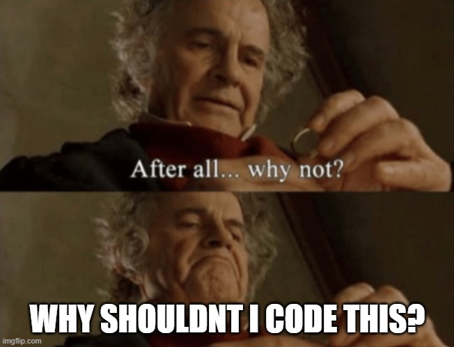
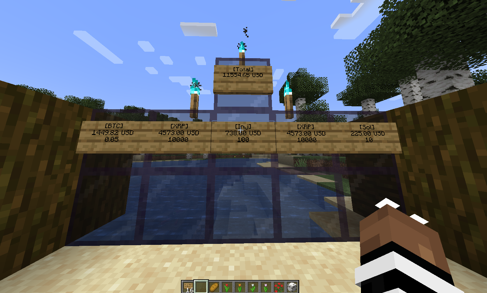

# Kryptokraft

En Minecraft-plugin for Bukkit/Spigot som lar deg se verdien av kryptovalutaene dine på skilt i minecraft. Du kan også se den totale verdien av alle kryptovalutaene dine på et eget skilt.

## Hvorfor?
Fordi det er mindre stressende å se på porteføljet ditt mens du spiller minecraft enn å febrilsk oppdatere mexc.

## Funksjoner

- Vis verdien av individuelle kryptovaluta på skilt, alle kryptovalutaer listet på cryptocompare kan sjekkes
- Vis den totale kombinerte verdien av beholdningen din i alle valuta du lager skilt for
- Oppdater prisen ved å høyreklikke på skiltene

## Installasjon

1. Last ned siste versjon av kryptocraft fra [Releases](https://github.com/bjornarvikhagen/kryptokraft/releases/tag/crypto)-siden. Her ligger min api-nøkkel inne. Du kan få låne den
2. Sett .jar-filen i plugins-mappen på serveren din
3. Restart serveren eller /reload om du ikke er så redd for å kræsje greia

## Bruk

### Vise verdien av individuelle kryptovaluta

1. Plasser et skilt på en blokk
2. Skriv symbolet for kryptovalutaen du ønsker å vise på den første linjen på skiltet, omgitt av firkantede parenteser. For eksempel: `[BTC]` for Bitcoin eller `[DOGE]` for Dogecoin. Her kan alle krypto fra cryptocompare.com brukes.
3. Skriv mengden kryptovaluta du har på den TREDJE linjen på skiltet, f.eks 0.1 bitcoin
4. Høyreklikk på skiltet for å oppdatere verdien som vises

### Vise den totale kombinerte verdien av alle kryptovaluta

1. Plasser et skilt på en blokk
2. Skriv `[TOTAL]` på den øverste linjen på skiltet.
3. Høyreklikk på skiltet for å oppdatere den totale summen av beholdningene dine

